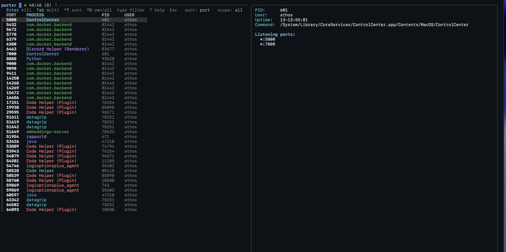

# terminal-tools


Three keyboard-driven terminal TUIs built on
[fzf](https://github.com/junegunn/fzf): a Kubernetes cockpit (`kube`), a log
follower (`logs`), and a TCP-port process killer (`ports`).

| Tool | What it does |
|------|--------------|
| **`kube`** | A Kubernetes cockpit: problems on top, then every workload / pod / node / ingress / secret / IP, with live metrics, contextual actions (restart, scale, exec, port-forward, logs…) and auto-refresh. A lightweight, keyboard-first take on `k9s`. |
| **`logs`** | Follow logs of any workload across all namespaces — one color per pod, auto-reconnect on restarts. |
| **`ports`** | View and kill processes listening on TCP ports (macOS), with a confirm step. |

Every mutating action **prints the real command it runs** (`$ kubectl rollout
restart …`, `$ kill -TERM …`) before executing — so the TUI doubles as a way to
learn the commands underneath.

## Demo

**`ports`** — find and kill whatever is holding a TCP port; contextual header,
one color per process, and live details in the preview pane:



**`kube`** — problems surface on top, the header shows the keys that apply to the
current tab, and columns stay labeled and aligned:

```text
overview │ pods │ nodes │ events │ ingress │ config │ ips     ns: all   sort: name   live: 5s
Enter logs  ^R restart  ^S scale  ^D describe  ^Y yaml  ^X delete  ^P pods  ^A more  │  ^N ns  ^T sort  ^L live  Tab view  ? help  Esc
NAMESPACE           NAME                        KIND    READY   IMAGE                 CPU      MEM
● platform          api-gateway                 deploy  1/2     api-gateway:2.3.1      12m     40Mi
  web               web-frontend                deploy  5/5     web-fronten~:v2.3    1276m   4435Mi
  data              cache                       sts     1/1     redis:7.2.4            92m    972Mi
```

<!-- Record a real (colored) GIF and drop it at docs/demo.gif, then uncomment:

-->

## Highlights

- **One persistent `fzf` instance** per session — views, sorting, namespace
  scoping, actions and refresh all happen *in place*, no flicker.
- **Contextual keybar** — the header always shows the keys that apply to the
  current view (nodes shows `cordon/drain`, pods hides `restart/scale`, …).
- **Auto-refresh** with cached feed + preview, so live data never hammers the
  cluster or repaints noisily.
- **Command transparency** — learn `kubectl` / `kill` by seeing every command.
- **Light- and dark-theme friendly** colors (no hard-coded assumptions).

## Requirements

- [`fzf`](https://github.com/junegunn/fzf) `≥ 0.30` (`brew install fzf`)
- `zsh`
- `kube` / `logs`: [`kubectl`](https://kubernetes.io/docs/tasks/tools/) with a
  configured context (uses the **current** context; metrics need
  `metrics-server`)
- `ports`: `lsof` (ships with macOS)

## Install

```sh
git clone https://github.com/athosmartinez/terminal-tools.git
cd terminal-tools
./install.sh            # symlinks kube, logs, ports into ~/.local/bin
```

`install.sh` symlinks the three entry points into `~/.local/bin` (make sure it's
on your `$PATH`). Because they're symlinks, editing files in the repo updates the
installed tools instantly. The shared `lib/` is resolved relative to each script,
so it travels with the repo.

## Usage

```sh
kube                 # open the cockpit
logs                 # pick a workload and follow its logs
logs <query>         # 1 match → follow immediately
logs <ip>            # resolve a pod / service / node / ingress IP and follow it
ports                # pick a listening process to kill
ports <port|name>    # filter; `ports kill <q>` to kill directly
<tool> -h            # help  ·  press ? inside any picker for the keys
```

### Keys

**`kube`**
```
Tab / Shift-Tab  switch view        ^N  namespace scope    ^T  cycle sort
Enter            primary action     ^D  describe+events     ^Y  view YAML
^R restart  ^S scale  ^X delete  ^P pods    ^A  actions menu (the long tail)
^L  toggle auto-refresh   F5  reload now    ?  help          Esc quit
```
The **actions menu** (`^A`) carries everything else — rollback, set-image,
exec/shell, port-forward, cordon/uncordon/drain, cronjob trigger, secret reveal,
`kubectl cp`, and more. Mutations always confirm first; `^Y` in the menu copies
the resolved command to the clipboard.

The **`ips` view** (last tab) lists every IP in the cluster in one table — pod
IPs, Service ClusterIPs and external IPs, node addresses, ingress external IPs —
sorted numerically, so typing part of an address narrows to a subnet. `Enter`
does the right thing per row: logs for a pod, port-forward for a Service, pods
for a node, open the URL for an ingress.

**`logs`** — `Enter` follow · `^P` pod view · `^F` follow by IP · `^N` namespace
scope · `^T` sort (name / ns / unready first) · `?` help · `Esc` quit

`^P` already filters by **pod** IP: the pod view is `kubectl get pods -A -o
wide`, which carries an IP column. `^F` (and `logs <ip>`) adds what `^P` can't —
resolving **Service, node and Ingress** addresses. Order is **node > pod >
Service > Ingress**: a `hostNetwork` pod only borrows its node's address, so a
node IP answers with the node and lists the borrowing pods as a note. A
LoadBalancer address normally sits on the Service in front of the ingress
controller *and* on every Ingress behind it, so it resolves to that Service and
opens its pods; an Ingress IP no Service shares is identified only.

**`ports`** — `Enter` kill · `Tab` multi-select · `^T` sort (port / process / pid
/ user) · `^O` toggle own/all processes · `?` help · `Esc` cancel

### Environment knobs

| Variable | Default | Effect |
|----------|---------|--------|
| `KUBE_REFRESH` | `5` | kube auto-refresh interval (seconds); `0` starts paused |
| `KUBE_PREVIEW_TTL` | `20` | kube preview cache TTL (seconds) |
| `LOGS_REFRESH` / `PORTS_REFRESH` | `5` / `4` | picker auto-refresh; `0` disables |
| `LOGS_PREVIEW_TTL` | `20` | logs preview cache TTL (seconds) |
| `KUBE_ALL` | — | `1` shows cert-manager ACME solver ingresses too |

## Notes

- `ports` is macOS-specific (`lsof` flags). `kube` / `logs` run wherever
  `kubectl` + `fzf` do.
- Everything runs against your **current** `kubectl` context. There is no hidden
  state or config — the tools read live from the cluster.

## License

MIT — see [LICENSE](LICENSE).
